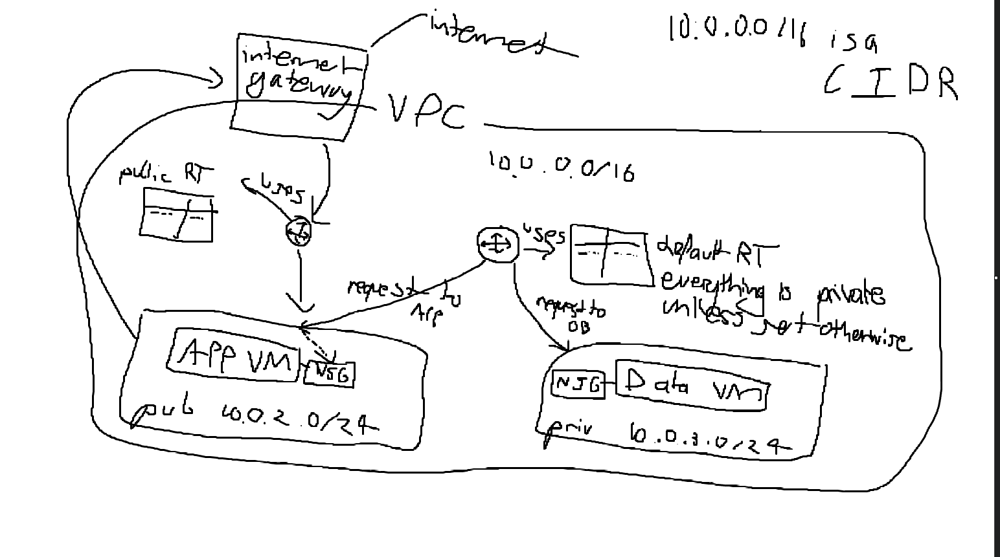

# VPC's
Shared with everyone else using the public clou, there is a default VPC created in every region.
Like having oyur own apartement in a building by default. You get it automatically. Like a shared flat.
# Subnets
## 
Subnets are like rooms in a flat/apartement, in the ireland region in hte default VPC there are 3 subnet rooms, a,b and c. Each subnet is its own availability zone. Availability, if one fails the others still work, it provides redundancy and is part of disaster recovery. Each avaialbilty zone is its own data centre with its own CPU's centre etc.
You can decide whether these are public or private, by default they are all public. This is undesireable.
The database needs to be private, you want the best security for the databases, GDPR etc.
## 
## 