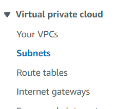

# VPC's
Shared with everyone else using the public clou, there is a default VPC created in every region.
Like having your own apartment in a building by default. You get it automatically. Like a shared flat.
# Subnets
## 
Subnets are like rooms in a flat/apartement, in the ireland region in hte default VPC there are 3 subnet rooms, a,b and c. Each subnet is its own availability zone. Availability, if one fails the others still work, it provides redundancy and is part of disaster recovery. Each avaialbilty zone is its own data centre with its own CPU's centre etc.
You can decide whether these are public or private, by default they are all public. This is undesireable.
The database needs to be private, you want the best security for the databases, GDPR, law suits etc.
## 
## 
# An ised on CIDR, the first part is the enforced Ip and the number after the "/" is the amouont of pits from left to right which format is enforced.
# order of work
##
- vpc
- subnet
- gateway
- public route table
- asoc to subnet
- asoc to gateway
- check vpc
- create db
- create app

set availability zones for subnets, assign different zones west,1ca

security group is associated with a VPC
the default one

jump box from one VM to another VM

# Steps to follow on AWS
### First get onto the AWS VPC 

### create a VPC on the top right

### Do not do an automatic creation and remember to set up CIDRs up correctly, manually and without ipv6 for this case
### Then you go and create a subnet

### this is very simple however do set up an appropriate name, for our architecture one will be public and the other will be private so those naming schemes are appropriate. The subnets also have to be linked. and created without the correct availability, in our case west.1a and west.1b for public and private respectively.

### creating gateway is also simple however later needs to be linked. you link it to the gateway
### You can check the VPC of the connection matches what you expect.

### here is one htat made sense for our project
### then we simply need to create the VM's the VM may not have access to the internet and so some must be run by AMI, the others can be run with User Data, the private ones will also not need to have a public Ip set up, correct ports still need to be open, keep in mind security and changing security groups later so that only thing that should be able to communicate with each other are able to.